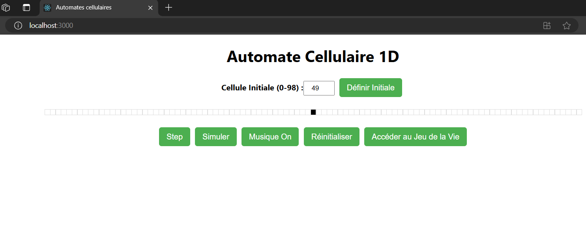
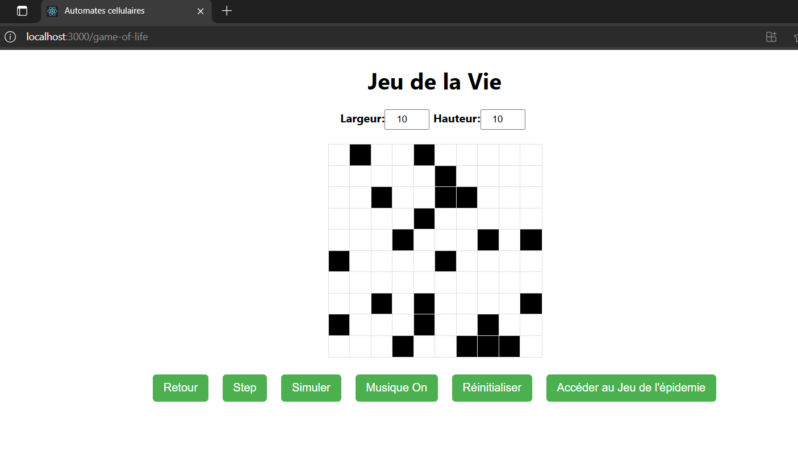
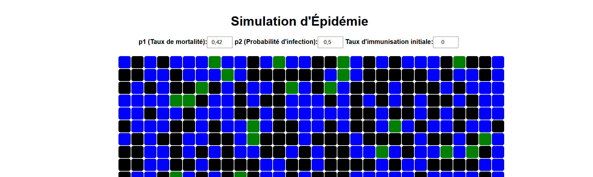
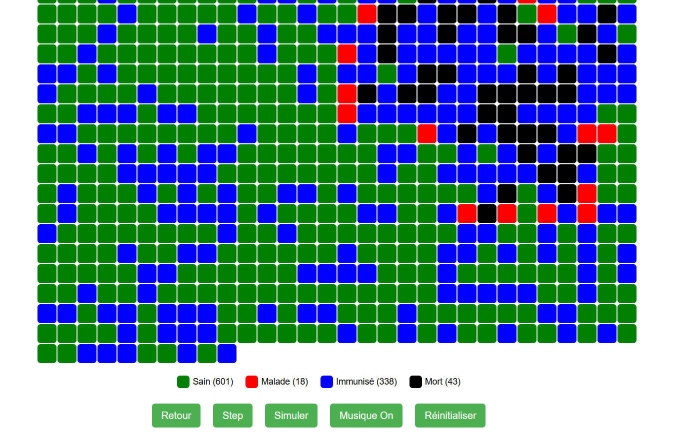

# INFO602_TP2
Automate cellulaire

## Guide d'installation et d'utilisation

### Prérequis 
Avant de commencer, assurez-vous d'avoir les outils suivants installés sur votre machine :

    Node.js (version 14 ou supérieure)
    npm (le gestionnaire de paquets de Node.js, inclus avec Node.js)

Vous pouvez vérifier si vous avez déjà Node.js et npm installés en exécutant les commandes suivantes dans votre terminal :

```aiignore
node -v
npm -v
```
Si vous n'avez pas Node.js installé, vous pouvez le télécharger depuis [nodejs.org](https://nodejs.org/).

### Étape 1 : Cloner le Répertoire du Projet

Commencez par cloner le répertoire du projet depuis le dépôt GitHub. Remplacez <URL-DU-DÉPÔT> par l'URL de votre dépôt Git.

```aiignore
git clone <URL-DU-DÉPÔT>
cd <NOM-DU-RÉPOT>
```

### Étape 2 : Installer les Dépendances

Une fois que vous avez cloné le projet, vous devez installer les dépendances nécessaires pour faire fonctionner l'application React.

Dans le terminal, à la racine du projet, exécutez la commande suivante :

```aiignore
npm install
```
Cela va télécharger et installer toutes les dépendances définies dans le fichier package.json.

### Étape 3 : Démarrer l'Application en Mode Développement
Une fois les dépendances installées, vous pouvez démarrer l'application en mode développement avec la commande suivante :

```aiignore
npm start
```
Cela va lancer un serveur local (généralement accessible sur http://localhost:3000) et ouvrir automatiquement l'application dans votre navigateur. Le serveur sera mis à jour automatiquement dès que vous modifiez des fichiers source (hot-reloading).

### Étape 4 : Utiliser l'Application
Une fois l'application lancée, vous pourrez interagir avec elle via le navigateur. Voici quelques fonctionnalités disponibles dans cette application :

- **Contrôles** : Vous pouvez ajuster les paramètres de la simulation (p1 et p2) via des champs de saisie.
- **Simulation** : Vous pouvez démarrer ou arrêter la simulation avec le bouton "Simuler". Vous pouvez également avancer d'une étape avec le bouton "Step".
- **Musique** : Vous pouvez activer ou désactiver la musique en cliquant sur le bouton "Musique On/Off".
- **Réinitialisation** : Le bouton "Réinitialiser" réinitialise l'état de la simulation avec les valeurs de départ.

### Étape 5 : Arreter l'Application

Vous pouvez faire ctrl + c pour terminer le programme 

## Exemple de vue 

### Page Automates cellulaires 1D


### Page Jeu de la vie

### Page Epidémie 


## Sources

[squid game season 2 music round and round](./automate/public/Mingle_Song_Squid_Game_Round_And_Round-653466.mp3)

## Auteurs

Mathieu LIN 3ème année de licence informatique de l'Université Savoie Mont-blanc.